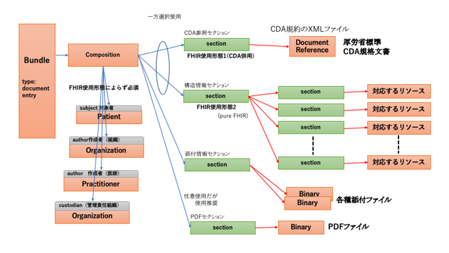



日本医療情報学会　2021年10月 Ver. 1.0.2 (2022.2.24) 
日本HL7協会　2021年10月

# **退院時サマリー HL7 FHIR記述仕様 第1版**

## 本仕様書の位置づけ
この仕様書は、HL7 FHIR（以下、単に「FHIR 」という）に準拠した退院時サマリーの記述仕様を記述した文書であり、令和2年度厚生労働行政推進調査事業費補助金 令和2年度厚生労働科学特別研究事業「診療情報提供書, 退院時サマリー等の電子化医療文書の相互運用性確保のための標準規格の開発研究」 (課題番号20ⅭＡ2013）（以下、単に「R2厚生科研研究班」という）の成果物を、その作成者らが編集したものである。
以下では本仕様書という。
本仕様書は、厚生労働省標準HS032「HL7 CDA に基づく退院時サマリー規約」（日本 HL7 協会）（以下、「CDA退院時サマリー規約」、もしくは単に「CDA規約」という）を参考にして、FHIRに準拠した記述仕様として作成されたものであり、電子化に伴う新たな退院時サマリー様式のあり方を再検討して作成されたものではない。
また、本仕様書の作成にあたって、ベースとした仕様には、FHIR R4に修正を加えたVer.4.0.1(Oct-30, 2019)を採用しているが、それ自体がNormative（標準） として確定した仕様となっていないものを多く含んでいる。そのため、元となるFHIR仕様が変更されることがあるが、本仕様書の明示的な改版時まではその変更の影響を受けないものとする。
## 参照する仕様等
本仕様書は、以下の仕様等を参照している。
HL7FHIR R4 Ver.4.0.1 [[http://hl7.org/fhir/index.html](http://hl7.org/fhir/index.html)]　 本仕様書ではFHIR基底仕様という。
厚生労働省標準HS032「HL7 CDA に基づく退院時サマリー規約（日本 HL7 協会）」 [[http://www.hl7.jp/library/item/HL7J-CDA-007.pdf](http://www.hl7.jp/library/item/HL7J-CDA-007.pdf)]
HL7 FHIR Jp Core Implementation Guide(Jp Core実装ガイド) [[https://jpfhir.jp/fhir/core/](https://jpfhir.jp/fhir/core/)]

## 文書データの表現形式
### ファイル形式
ファイル形式は、JSON形式（JavaScript Object Notation：RFC 8259、IETF STD 90、ECMA-404 2nd edition）とする。
ファイル名を有するファイルを作成する場合には、特に送受信施設間で別の取り決めがない限り、.json の拡張子を末尾に付与するものとする。
### 文字集合
文字集合はUnicode文字セットとする。これはISO/IEC 10646：2017 （JIS　X0221国際符号化文字集合）と同一である。
### 符号化形式
文字符号化形式は、UTF-8（ISO/IEC 10646　UCS Transformation Format 8）とする。ネットワーク上で直接データを送受信することを想定し、バイト順マーク（BOM：byte order mark：UTF-8では0xEF 0xBB 0xBF ）を先頭に付与しないものとする。

## 退院時サマリーFHIR記述の全体構造
### 全体構造
FHIR では、医療情報はFHIRリソースと呼ばれる単位で記述される。退院時サマリーは文書形式のデータの一種であり、また退院時サマリー文書本体に必要なら電子署名ができ、またそれを利用して改ざん検知及び否認防止ができることが必要であると考えられる。 
Bundleリソースは、複数のFHIRリソースの集合を、あるコンテクストに関する情報（この場合には、退院時サマリーの交付と取得に関する日付情報や発行者、発行機関情報など）とともにひとまとまりの情報にまとめあげたものを記述するのに使われるFHIRリソースであり、以下のような要素から構成される。あるシステムから別のシステムに退院時サマリーを送信する場合は、このBundleリソースの単位で行われる。

図 1 Bundleリソース（http://hl7.org/fhir/bundle.html）

そして、このBundleリソースのtype要素（上図左段の2つめの要素）の値を"document"とすることにより、Bundleリソースのひとつのタイプである、FHIR Documentを記述できる。 
そこで、本仕様書では、退院時サマリー文書ひとつを、FHIRにおけるBundleリソース のひとつのタイプであるFHIR Documentにより記述することとする。[[http://hl7.org/fhir/documents.html](http://hl7.org/fhir/documents.html)]

以降の章では、退院時サマリーを構成するFHIRリソースの記述仕様を、次の項目に従って共通の表形式で記述する。

||項目|説明 |
|--|--|--|
|1|No|表内で要素を識別するための番号。同一階層を同一桁数で表す。|
|2|要素　　　Lv  1～n|FHIRリソースに含まれる要素。要素の階層ごとに列を分けて記載する。|
|3|多重度|要素の出現数の最小値と最大値を表す。最小値が0の要素は、省略することができる。最小値が1の要素は必ず出現しなければならない。|
|4|値|固定値、あるいは、例示された値。 |
|5|型|要素のデータ型。 |
|6|説明|要素の説明と記録条件仕様。 |

本仕様書は、FHIR基底仕様で定義されたリソース、及び、データ型の定義に対して、退院時サマリー仕様のための制約を追加している。そのため、要素の多重度や使用可能なコード値について、FHIR基底仕様に、より強い制約が加えられていることに注意する。
また、表中では、繰り返し可能なJSON要素を、多重度 0..\* 、または、1..\* として1行で記述する方法と、繰り返しの要素ごとに展開して記述する方法の2通りの書き方を使用している。いずれの場合も、繰り返される要素は、JSONインスタンス中では [ 　] で括られた配列として表現され、要素名は1つしか出現しないことに注意する。
本仕様書で必須とした項目は、退院時サマリーの記載内容として必要となる項目であるため必ず指定すること。逆に、FHIRリソースで定義されている任意要素で、本仕様書に記載していない要素は、JSONインスタンス中に出現してはならない。
なお、本仕様書の表で出現するデータタイプのうち、基本データタイプについては、5章で説明している。

### FHIR Document
FHIR Documentの仕様では、entry要素内（上図右段の先頭の要素）にresource要素を繰り返す基本構造をとり、最初のresource要素はComposition リソースであることと規定されている。Composition リソースとは、この文書に含まれる他のすべてのリソース（情報単位）への参照を列挙するためのもので、いわば構成リソースの一覧目次のような役割を果たす。
退院時サマリーDocumentでは、Bundleリソースは次表のように35種類のエントリ要素と、それらの参照リストである先頭のCompositionリソースからなる構造である。

|エントリ(entry)で表現する情報|使用されるFHIRリソース|リソースの多重度|
|-------|---|---|
|Bundleに含まれる全リソースエントリの参照リスト|Compositionリソース|1..1|
|患者情報エントリ|Patientリソース|1..1|
|文書作成責任者情報エントリ|Practitionerリソース|1..1|
|文書法的責任者情報エントリ（文書作成責任者情報と同じ場合省略）|Practitionerリソース|0..1|
|文書作成機関情報エントリ|Organizationリソース|1..1|
|文書管理責任機関エントリ（文書作成機関情報と同じ場合省略）|Organizationリソース|0..1|
|文書作成責任者の所属診療科情報エントリ（文書作成機関情報と同じ場合省略）|Organizationリソース|0..1|
|文書法的責任者の所属診療科情報エントリ（文書作成機関情報と同じ場合省略）|Organizationリソース|0..1|
|入院詳細情報エントリ(退院時詳細情報、入院理由、入院時診断、退院時診断を含む)|Encounterリソース|1..1|
|入院期間中の診断情報エントリ（入院詳細情報エントリから参照される）|Conditionリソース|1..\*|
|入院前の所在施設（入院詳細情報エントリから参照される）|Observationリソース|0..\*|
|入院前の所在場所（入院詳細情報エントリから参照される）|Locationリソース|0..\*|
|退院先の所在施設（入院詳細情報エントリから参照される）|Observationリソース|0..\*|
|退院先の所在場所（入院詳細情報エントリから参照される）|Locationリソース|0..\*|
|入院中の所在場所（入院詳細情報エントリから参照される）|Locationリソース|0..\*|
|アレルギー・不耐性反応情報エントリ|AllergyIntoleranceリソース|0..\*|
|入院時主訴情報エントリ|Conditionリソース|0..\*|
|現病歴情報エントリ|Conditionリソース|0..\*|
|既往歴情報エントリ|Conditionリソース|0..\*|
|入院時服薬情報エントリ|MedicationStatementリソース|0..\*|
|入院時社会歴エントリ|Observationリソース|0..\*|
|入院時身体所見情報エントリ|Observationリソース|0..\*|
|入院時家族歴情報エントリ|FamilyMemberHistoryリソース|0..\*|
|入院中経過情報エントリ|DocumentReferenceリソース|1..\*|
|退院時投薬指示情報エントリ|MedicationRequest リソース|0..\*|
|退院時処方箋エントリ|Bundle(電子処方箋) リソース|0..\*|
|退院時方針指示情報エントリ|CarePlanリソース|0..\*|
|退院時身体所見情報エントリ|Observationリソース|0..\*|
|入院中治療情報エントリ|Procedureリソース|0..\*|
|入院中検査結果情報エントリ|Observation \| ImagingStudy \| DiagnosticReport) リソース|0..\*|
|医療機器情報エントリ|DeviceUseStatementリソース|0..\*|
|予防接種歴情報エントリ|Immunizationリソース|0..\*|
|事前指示情報エントリ|Consentリソース|0..\*|
|臨床研究参加情報エントリ|ResearchSubjectリソース|0..\*|
|添付文書情報エントリ|DocumentReferenceリソース|0..\*|
|添付データ情報エントリ|Binaryリソース|0..\*|
|PDF情報エントリ|DocumentReferenceリソース|0..\*|

Bundleリソースは図のように、Compositionリソースにてセクションが複数定義され、セクションではリソースが参照される。後述するように、CDA規約のXMLファイルを参照するCDA参照セクションだけからなる使用形態と、すべての情報をFHIRリソースで記述して構造情報セクションから参照する使用形態のいずれかひとつを使用者は選択するものとする。なお、いずれの使用形態でも、PDFセクションを付与して、文書全体をPDFファイル化して受領者が容易に内容を表示できるようにすることが強く推奨される。

【注意】　PDFセクションによるPDFファイルの格納は、CDA参照セクションまたは構造情報セクションのどちらかに格納された情報の必須セクションの情報を目視確認できるようにするためのあくまで補助的な情報であり、CDA参照セクションまたは構造情報セクションのどちらか一方だけの情報で診療情報提供書として必要十分な情報が取得できなければならない。 
　CDA参照セクションまたは構造情報セクションに意味のある情報を格納せずに、PDFセクションにPDFファイルだけを格納することは本仕様として許容されない。同様に、添付情報セクションや備考・連絡情報セクションだけに情報を格納することも本仕様として許容されない。

Bundleリソース全体の構造を以下の表に示す。

＜[表3　　Bundleリソース　文書情報]()＞

この表で示すように、documentタイプのBundleリソースでは、管理的な情報を格納する要素としてtimestamp、 signature などがあり、文書自体の内容情報を格納する要素として、ひとつのentry要素（エントリリスト）がある。このentry要素の値には、複数のresource要素を含むブロックが繰り返される。 
この表では様々なentryが列挙されているが、先にも述べたように、entry要素自体は1度だけ出現し、その値がリストとなることに注意されたい。 
entryの最初のresource は、先に述べたように、構成リソース一覧目次を表すCompositionリソースである。 
２つめのリソース以降に、Compositionリソースから参照される Patientリソース、などが出現する。 
エントリリスト内の各FHIRリソースを記述する際には、エントリリスト内でそのリソースを一意に識別するために、resource要素と1対1で対応するfullUrl要素に、UUID（Universally Unique IDentifier）と呼ばれる、全世界で一意となるように発番された値を指定する。 このUUIDは、Bundle内でリソース間の参照関係を記述する場合に使用される。具体的には、参照関係の参照元リソースに含まれる Reference型のreference要素に、参照先リソースの fullUrl要素に指定されたUUIDを指定する。 
なお、FHIRのリソース参照では、リソースのid要素（論理ID）の値を含むURLを使用する方法も可能であるが、本仕様書ではUUIDを使用してリソース間の参照を記述する方法を採用するため、全てのリソースについて、リソースの論理IDは使用しない。

以下では、まずentryの値である各リソースについて詳述する。

### Compositionリソース
Compositionリソースは、退院時サマリーFHIR documentにentry として格納される複数のリソースのうちの最初に出現するもので、この文書全体の構成目次に相当する情報や、セクションの構成を記述したものである。 
退院時サマリーFHIR documentでの Compositionリソースの仕様を次の表に示す。

＜[表5　　Compositionリソース　文書構成情報]()＞

退院時サマリーは、あとで説明するように4つのセクション（CDA参照セクション、構造情報セクション、PDFセクション、添付情報セクション）から構成され、さらにそのうち構造情報セクションには子となるセクションが複数配置されている。 
Compositionリソースは患者や作成者など文書情報管理用の情報を記述するいわゆるヘッダ部、および退院時サマリー文書の本体内容を記述するボディー部から構成される。 
ヘッダ部の情報はCompositionリソースの要素により記述され、ボディー部の情報は構造情報セクションの配下の複数のセクションから構成される。 
なお、ヘッダ部、ボディー部という表現は、ここでCDA退院時サマリー規約（本仕様書ではCDA規約と略すこともある）との対比をわかりやすくするために便宜上用いているが、Composition リソース内で明示的に区別されるわけではない。

**文書管理情報（ヘッダ部）**

|No|情報名称|Composition リソースの要素|必須/任意|対応する CDA退院時サマリー 規約の要素名|参照先の FHIR リソース種別|
|---|-------|---|---------|-----------|------------|
|1|患者情報|subject|必須|患者情報|Patient|
|2|作成・編集日時|date|必須|―|―|
|3|文書作成責任者|author|必須|退院時サマリー記載責任者|Practitioner|
|4|文書法的責任者|attester(.mode=legal)||退院時サマリー承認者|Practitioner|
|5|文書作成機関|author|必須|―|Organization|
|6|文書管理責任機関|custodian||原本保管管理|Organization|

**サマリー****本体（ボディー部）でのセクション構成****（構造情報セクションの下のセクション）**

|セクション コード|セクション名（日本語）セクション名（英語）|必須/任意|対応するCDA退院時 サマリー規約の要素名|section.entry 参照先のFHIR リソース種別|section.&emsp;entryの 多重度|
|---|---|--------|-----------|---------|-----------|
|200|CDA参照セクション cdaSection|*注|該当なし|DocumentRefrence  (CDA規約文書ファイルに限る)|1..1|
|300|構造情報セクション compositionSection|*注|該当なし|Composition|1..1|
|&nbsp;&nbsp;&nbsp;\|&nbsp;322|入院時詳細セクション detailsOnAdmissionSectionadmissionDetailsSection|必須|入院時情報、入院時補足情報、入院時主訴・入院理由|Encounter本表の 他のEncounterと 同一インスタンスを参照。|1..1|
|&nbsp;&nbsp;&nbsp;\|&nbsp;342|入院時診断セクション diagnosesOnAdmissionSection|必須|入院時情報|Condition|0..1\*|
|&nbsp;&nbsp;&nbsp;\|&nbsp;510|アレルギー・不耐性反応セクション allergiesIIntoleranceSection|任意|アレルギー・不適応反応|AllergyIntolerance|0..\*|
|&nbsp;&nbsp;&nbsp;\|&nbsp;352|主訴セクション chiefComplaintsSection|必須|主訴|Condition|0..\*|
|&nbsp;&nbsp;&nbsp;\|&nbsp;312|入院理由セクション reasonForAdmissionSection|必須|入院理由|Encounter本表の 他のEncounterと 同一インスタンスを参照。|0..1|
|&nbsp;&nbsp;&nbsp;\|&nbsp;362|現病歴セクション presentIllnessSection|必須|入院前経過.現病歴|Condition|0..\*|
|&nbsp;&nbsp;&nbsp;\|&nbsp;372|既往歴セクション pastIllnessSection|任意|入院前経過.既往歴|Condition|0..\*|
|&nbsp;&nbsp;&nbsp;\|&nbsp;432|入院時服薬セクション medicationsOnAdmissionSection|任意|入院前経過.常用薬|MedicationStatement|0..\*|
|&nbsp;&nbsp;&nbsp;\|&nbsp;642|社会歴・生活習慣セクション socialHistorySection|任意|入院前経過.社会歴|Observation|0..\*|
|&nbsp;&nbsp;&nbsp;\|&nbsp;612|入院時身体所見セクション physicalStatusOnAdmissionSection|任意|入院前経過.身体所見|Observation|0..\*|
|&nbsp;&nbsp;&nbsp;\|&nbsp;552|家族歴セクション familiyHistorySection|任意|入院前経過.家族歴|FamilyMemberHistory|0..\*|
|&nbsp;&nbsp;&nbsp;\|&nbsp;333|入院中経過セクション hospitalCourseSection|必須|入院経過|DocumentReference|1..\*|
|&nbsp;&nbsp;&nbsp;\|&nbsp;324|退院時詳細セクション detailsOnDischargeSection|必須|退院時の状態|Encounter本表の 他のEncounterと 同一インスタンスを参照。|1..1|
|&nbsp;&nbsp;&nbsp;\|&nbsp;344|退院時診断セクション diagnosesOnDischargeSection|必須|退院時情報|Condition|1..\*|
|&nbsp;&nbsp;&nbsp;\|&nbsp;444|退院時投薬指示セクション medicationOnDischargeSection|必須|退院時投薬指示|MedicationRequest ｜Bundle(電子処方箋)|0..\*|
|&nbsp;&nbsp;&nbsp;\|&nbsp;424|退院時方針指示セクション instructionOnDischargeSection|必須|退院時方針|CarePlan|0..\*|
|&nbsp;&nbsp;&nbsp;\|&nbsp;614|退院時身体所見セクション physicalStatusOnDischargeSection|任意|―|Observation|0..\*|
|&nbsp;&nbsp;&nbsp;\|&nbsp;713|入院中治療セクション hospitalProcedureSection|任意|手術・処置・治療|Procedure|0..\*|
|&nbsp;&nbsp;&nbsp;\|&nbsp;623|入院中検査結果セクション hospitalStudySection|任意|（検体・画像・生理・病理）検査結果|Observation \|  ImagingStudy \|  DiagnosticReport \|  Bundle  (報告書)|0..\*|
|&nbsp;&nbsp;&nbsp;\|&nbsp;810|医療機器セクション medicalDeviceSection|任意|医療機器|DeviceUseStatement|0..\*|
|&nbsp;&nbsp;&nbsp;\|&nbsp;530|予防接種歴セクション immunizationSection|任意|感染症・予防接種歴|Immunization|0..\*|
|&nbsp;&nbsp;&nbsp;\|&nbsp;410|事前指示セクション advanceDirectiveSection|任意|事前指示|Consent|0..\*|
|&emsp;└&emsp;830|臨床研究参加セクション researchParticipationSection|任意|―|ResearchSubject|0..\*|
|210|添付情報セクション attachmentSection|任意|―|DocumentReference \|  Binary|0..\*|
|230|PDFセクション pdfSection|任意|―|DocumentReference \|  Binary|0..\*|

*注：CDA参照セクションと構造情報セクションのどちらか一方だけ存在すること。 
Composition.identifier要素には、その医療機関が発行した退院時サマリーをその医療機関内において一意に識別するID（退院時サマリー番号）を設定する。 
施設固有のID設定方式を用いて構わないが、Identifier型のvalue要素に、保険医療機関番号（10桁）、発行年（4桁）、施設内において発行年内で一意となる番号（8桁）をハイフン("-"：U+002D)で連結した文字列を指定する方法を本仕様では具体的として採用している。
例："1311234567-2020-00123456"。  
この場合には、Identifier型のsystem要素には、"http://jpfhir.jp/fhir/core/IdSystem/resourceInstance-identifier"を指定する。

### Compositionリソースから各リソースへの参照
以下では、内部の各FHIRリソースインスタンスを参照するCompositionの要素について概説する。 

#### Composition.subject要素
この退院時サマリーを作成する対象となる患者をPatientリソースを、そのPatientリソースのリソースIDである"urn:uuid: ..... "　を記述することにより内部参照する。 
必須要素である。

Patientリソースの仕様は次の表で示す。

＜[表21　　Patientリソース　患者情報]()＞

#### Composition.encounter要素
この退院時サマリーを作成する元となった入院情報を表すEncounterリソースを、そのEncounterリソースのリソースIDである"urn:uuid: ..... "　を記述することにより内部参照する。 
任意要素である。 
Encounterリソースの仕様は次の表で示す。

＜[表12　　Encounterリソース　入院詳細情報]()＞

#### Composition.author要素
この退院時サマリー文書の作成責任者を表すPractitionerリソースを、そのPractitionerリソースのリソースIDである"urn:uuid: ..... "　を記述することにより内部参照する。 
さらに同じ要素に、続けて文書作成機関を表すOrganizationリソースを、そのOrganizationリソースのリソースIDである"urn:uuid: ..... "　を記述することにより内部参照する。 
文書作成責任者（Practitionerリソース）と文書作成医療機関情報（Organizationリソース）は共に必須である。診療科情報（Organizationリソース）は任意である。 
Practitionerリソース、Organizationリソースの仕様はそれぞれ次の表で示す。

＜[表22　　Practitionerリソース　　文書作成責任者情報/文書法的責任者情報]()＞
＜[表19　　Organizationリソース　文書作成医療機関情報]()＞
＜[表20　　Organizationリソース　診療科情報]()＞

#### Composition.custodian要素
この退院時サマリー文書の作成・修正を行い、文書の管理責任を持つ機関を表す。 
文書作成機関と同一の組織の場合、custodian要素からは文書作成機関を表すOrganizationリソースのリソースIDである"urn:uuid: ..... "　を記述することにより内部参照する。 
文書作成機関とは異なる組織である場合は、文書作成機関とは別のOrganizationリソースで記述し、custodian要素からはそのOrganizationリソースのリソースIDである"urn:uuid: ..... "　を記述することにより内部参照する。
必須要素である。

#### Composition.event要素
この退院時サマリーの対象となった入院期間（入院日と退院日）をComposition.event.preiod.start 要素とComposition.event.preiod.end 要素とに、それぞれ"yyyy-mm-dd"の形式で格納する。

#### Composition.section要素
すべてのComposition.section要素は、以下の構造をとる。

＜[表5-3* *Composition_sectionの情報構造]()＞

Composition.sectionの直下には、4つのsectionが子要素として存在している。
1) CDA参照セクション
2) 構造情報セクション
3) 添付情報セクション
4) PDFセクション

これらのうち1）は既存のCDA規約にもとづいてすでに十分に構造化されたXMLファイルを有していて、それをそのまま包み込むことによって、FHIRドキュメント作成になるべくコストを割きたくない場合を想定して、それぞれ用意されている。
以下では、この使い方について説明する。

####     1. ***退院時******サマリー******が******CDA******規約ファイルとして作成済みの場合の記述***
既存のCDA規約で作成されたXMLファイルをそのまま参照したい場合には、「CDA参照セクション」を使用する。 
　セクションコード：200 
　このセクションと次の構造情報セクションのどちらか一方は必須であり、両方同時に存在してはならない。 
他の場所に保存されているFHIRドキュメントを参照する場合にもこの要素を用いる。 
この要素が出現した場合、必要があって「添付情報セクション」を作成する場合と、本文書データをPDFファイルでも送付する場合に「PDFセクション」を作成する場合を除き、他のすべてのセクションを出現させないものとする。 
本文書データを受領して利用する側は、「CDA参照セクション」が存在し、情報が格納または参照されている場合には、「CDA参照セクション」の情報、存在する場合には「添付情報セクション」との2つのセクションの情報を、完結した本文書データとして利用しなければならない。「PDFセクション」が存在する場合にはその情報を表示用や印刷用に使用することができる。もし他に「構造情報セクション」の情報が存在したとしても、無視する必要がある。 
なお、文書管理情報（ヘッダ部）の情報は、この仕様にもとづいて作成し、Compositionリソースの要素に格納しなければならない。

####     2. ***退院時******サマリー******情報をセクションに構造化できる場合の記述***
退院時サマリーの情報がある程度構造化できる構成で管理されており、新たに本仕様にもとづいて作成する場合には、「構造情報セクション」を使用する。 
　セクションコード：300 
　このセクションと前項のCDAセクションのどちらか一方は必須であり、両方同時に存在してはならない。 
「構造情報セクション」は、**サマリー****本体（ボディー部）でのセクション構成**で示すように複数の子セクションから構成されている。 
これらの子セクションのうち、必須のセクションでは必ずそれに対応するComposition.section要素が出現しなければならない。ただし、実際に格納すべき情報が存在しない場合（例えば、退院時投薬がない場合など）では、その子セクション内にentry要素は出現せず**Composition.section. emptyReason****要素内に****コード****"**** ****nilknown**** ********"****を****意味するコード情報を格納することと****する。**********これにより、情報がないことが問題ない状態であることが明示的に示される。 
格納すべき情報を聴取（取得）しようとしていないために情報が存在していない場合であって、それを明示的に記述する（「取得せず」など）場合には子セクションのentry要素は出現せず、**Composition.section.****emptyReason**に "**notasked**" を記述する。 
情報が患者やシステムから取得できない状況でそれを明示的に記述する（「取得できず」「不明」など）場合には子セクションのentry要素は出現せず、**Composition.section.****emptyReason**に "unavailable" を記述する。 
それぞれの子セクションには、以降で説明するFHIRリソースへの参照が1個以上格納されるが、これらの構造的記述では十分に表現できない情報があって、そのセクション全体の情報を叙述的（もしくはプレーンテキストやHTML）に記述した情報を格納するには、**Composition.section.section.text** 要素に簡略xhtml形式（1MB以内のサイズ）で記述できる。 
従って、退院時サマリー情報を、以降で説明する各セクションに構造化することはできるものの、各セクションの内容をFHIRリソースで構造的に記述することができない場合には、そのセクションの情報は、そのセクションの**Composition.section.section.text** 要素にxhtml形式で記述し、Composition.section. emptyReason要素内に"unavailable"を意味するコード情報を格納することとする。これにより、FHIRリソースに対応した構造化情報がないことが明示的に示され、利用側は、そのセクションについては**Composition.section.section.text** 要素の叙述的記述（もしくはプレーンテキストやHTML）を利用する。

##   17. 入院時詳細セクション
入院期間中の詳細情報を記述したEncounterリソースを参照する。 
セクションコード：322 

＜[表12　　Encounterリソース　入院詳細情報]()＞

入院期間、入院時主訴・入院理由、入退院詳細情報、退院時転帰コード情報などが必須情報として記述される。 
Encounter リソースから参照することがあるリソース： 
　入院中診断情報　Condition （入院時、退院時を区別して含む） 
　入院前の所在場所　Location、Organization 
　退院先の所在場所　Location、Organization 
　入院中の所在場所　Location 

##   18. 入院時診断セクション
入院時診断は、入院期間中の詳細情報を記述したEncounterリソースから、入院中診断情報ConditionリソースのリストとしてEncounter.diagnosisで参照されている情報の一部である。Encounter.diagnosis.use要素（患者状態の診断位置付け区分）が「AD:入院時診断」となっているリソースインスタンスが入院時診断であるから、そのConditionのリストを、本セクションのentryから参照する。 
セクションコード：342 
Conditionリソースの仕様は次の表である。

＜[表6　　Conditionリソース　患者状態情報]()＞

##   19. アレルギー・不耐性反応セクション
アレルギー・不耐性反応情報を記述したAllergyIntoleranceリソースで記述される。 
セクションコード：510 
アレルゲンコードは、R2厚生科研研究班と日本医療情報学会NeXEHRS研究会HL7FHIR日本実装検討WG関係者とで共同策定した「JPFHIRアレルゲンコード表」を使用する。 
このコード表は、医薬品以外のアレルゲンにコードをアサインして策定したJFAGYコードと、医薬品（YJコードまたはWHO-ATCコードまたは厚労省一般医薬品コード）のいずれかのコードを使用できる新たなコード体系JPFHIRアレルゲンコード表である。

＜[表1　　AllergyIntoleranceリソース　アレルギー情報]()＞

##   20. 主訴セクション
入院時主訴は、入院期間中の詳細情報を記述したEncounterリソースから、入院中診断情報ConditionリソースのリストとしてEncounter.diagnosisで参照されている情報の一部である。Encounter.diagnosis.use要素（患者状態の診断位置付け区分）が「CC:入院時主訴」となっているリソースインスタンスが入院時主訴であるから、そのConditionのリストを、本セクションのentryから参照する。 
本来はこのセクションには入院時の当該情報を格納する想定である。しかし、作成される退院時サマリーの当該情報が、厳密に入院時の取得情報かどうか不明の場合も多い。いわゆる入院における当該情報に関する情報は、入院後の情報であることが明示されている場合は別として、情報取得時期が不明確である場合には、このセクションの当該情報として格納するものとする。 
セクションコード：352 
Conditionリソースの仕様は次の表である。

＜[表6　　Conditionリソース　患者状態情報]()＞

##   21. 入院理由セクション
入院理由は、入院期間中の詳細情報を記述したEncounterリソースで、reasonCode要素として記述されているので、本セクションでは同じEncounterリソースインスタンスを参照するだけでよい。 
セクションコード：312 

＜[表12　　Encounterリソース　入院詳細情報]()＞（再掲）

##   22. 現病歴セクション
病歴は、すべてConditionリソースのリストで記述できるため、これをentryから参照することで記述する。 
本来はこのセクションには入院時の当該情報を格納する想定である。しかし、作成される退院時サマリーの当該情報が、厳密に入院時の取得情報かどうか不明の場合も多い。いわゆる入院における当該情報に関する情報は、入院後の情報であることが明示されている場合は別として、情報取得時期が不明確である場合には、このセクションの当該情報として格納するものとする。明らかに入院中の経過については、入院中経過セクションに格納されることを想定している。 
入院時現病歴と入院中の経過を分離し難い場合には、すべてこのセクションに格納して差し支えない。 
セクションコード：362 
Conditionリソースの仕様は次の表である。

＜[表6　　Conditionリソース　患者状態情報＞]()（再掲）

##   23. 既往歴セクション
現病歴セクションと同仕様である。 
セクションコード：372 
現病歴セクションと同仕様である。

##   24. 入院時服薬セクション
入院時の服薬情報（正確には入院直前までの服薬情報）は、1医薬品ごとに1つのMedicationStatementリソースまたはMedicationRequestリソースを使用して記述する。MedicationStatementまたはMedicationRequestリソースでは、1医薬品ごとに用法を記述することができ、それが必要な場合で情報が入手できる場合には、MedicationStatement.dosageまたはMedicationRequest.dosageInstruction要素に記述する。 
セクションコード：432 
仕様は次の表である。

＜[表17　　MedicationStatementリソース　　服薬情報]()＞ 
＜[表17-1 MedicationStatement* *dosage　処方依頼情報の服薬用法情報]()＞

##   25. 社会歴・生活習慣セクション
社会（生活）歴情報は観察調査の一種として、1項目ごとに1つのObservationリソースを使用して記述する。Observationのcategory要素に"social-history"を設定する。 
項目コードObservation.code.coding.codeに設定すべき適切な標準コードがない項目の場合には、Observation.code.text にテキストで項目名だけを記述することもできる。 
セクションコード：642 
仕様は次の表である。

＜[表18　　Observationリソース　　検査・観察情報]()＞

##   26. 入院時身体所見セクション
入院時の身体所見は観察や検査所見の一種として、1項目ごとに1つのObservationリソースを使用して記述する。Observationのcategory要素に"exam"を設定する。 
項目コードObservation.code.coding.codeに設定すべき適切な標準コードがない項目の場合には、Observation.code.text にテキストで項目名だけを記述することもできる。 
セクションコード：612 
仕様は次の表である。

＜[表18　　Observationリソース　　検査・観察情報]()＞　（再掲）

##   27. 家族歴セクション
入院時に取得する家族歴情報は、家族一人について1つのFamilyMemberHistoryリソースを使用して記述する。 
セクションコード：552 
仕様は次の表である。

＜[表13　　FamiliMemberHistoryリソース　家族歴情報]()＞

##   28. 入院中経過セクション
入院中の経過は、ほとんどの場合、叙述的に記述することが必要である。経過中の主訴、診断や検査、投薬、治療などは他のセクションにおいて、Observation、ImagingStudy、DiagnositcReport 、Procedure、MedicationRequest、MedicationStatement、Encounter　などの各リソースで記述される。 
それ以外の入院中の経過は、主としてこれらのリソースで記述された客観的情報の時間的接続性に関する叙述的な記述や、患者のSubjectiveな記述、および医療者による評価所見（アセスメント的な印象）といった情報となる。本仕様ではDocumentReferenceリソースを使用し、DocumentReference.type にLOINCコード"11506-3"　（Progress note）を設定し、叙述的内容をDocumentReference.description要素に文章をstring型で記述する。 
セクションコード：333 
仕様は次の表に示す。

＜[表11*　　*DocumentReferenceリソース　 文書参照情報]()＞

##   29. 退院時詳細セクション
退院時の詳細情報は、入院期間中の詳細情報を記述したEncounterリソースに、hospitalization 要素として、退院時転帰、退院先、退院日などの情報が記述されている。また退院時診断は同じくdiagnosis要素にdiagnosis.use要素が"DD"(退院時診断)　として記述されている。 
従って本セクションでは同じEncounterリソースインスタンスを参照するだけでよい。 
セクションコード：324 

＜[表12　　Encounterリソース　入院詳細情報]()＞　（再掲）

##   30. 退院時診断セクション
退院時診断は、入院期間中の詳細情報を記述したEncounterリソースから、退院時診断情報ConditionリソースのリストとしてEncounter.diagnosisで参照されている情報の一部である。 
Encounter.diagnosis.use要素（患者状態の診断位置付け区分）が「DD:退院時診断」となっているリソースインスタンスが退院時診断であるから、そのConditionのリストを、本セクションのentryから参照する。 
セクションコード：344 
Conditionリソースの仕様は次の表である。

＜表6　　Conditionリソース　患者状態情報＞　（再掲）

##   31. 退院時投薬指示セクション
退院時処方は、1医薬品ごとに1つのMedicationReauestリソースを使用して記述する。MedicationReauestでは、1医薬品ごとに用法を記述しており、MedicationRequest.dosaggInstruction要素に記述する。 
セクションコード：444 
仕様は次の表である。

＜[表16　　MedicationRequestリソース　処方依頼情報]()＞ 
＜[表16-1 MedicationRequest dosageInstruction　処方情報の用法指示情報]()＞

記述方法の詳細は、処方箋データFHIR記述仕様を参照のこと。 
なお、処方箋データFHIR記述仕様にもとづいた処方箋文書（Bundleリソースインスタンス）を直接参照する方法でも記述できる。 
その場合、entryでの参照はそのひとつのBundleリソースインスタンスだけとなる。 

##   32. 退院時方針指示セクション
退院時（正確には退院後）の方針や患者や家族への指示は、ほとんどの場合に叙述的記述にとどまると考えられるが、この内容はFHIRでは、CarePlanリソースを使用して記述する。方針指示内容はCarePlanのdescription 要素に叙述的に記述する。 
セクションコード：424 
仕様は次の表である。

＜[表4　　CarePlanリソース　診療方針指示情報]()＞

##   33. 退院時身体所見セクション
入院時の身体所見と同仕様である。 
セクションコード：614 

##   34. 入院中治療セクション
入院中の治療・処置・手術等（投薬を除く）は、Procedureリソースを使用して記述する。 
note要素に叙述的記述はできるが、entry.textに記述してもよい。 
他のセクションで記述できない治療処置を記述するのに用いる。いわゆる治療・処置以外の、たとえばカウンセリングや支援サービスなども記述して差し支えない。 
セクションコード：713

＜[表23　　Procedureリソース　　入院中治療処置情報]()＞

##   35. 入院中検査結果セクション
入院中の検査結果は、検査室の検査や観察などはObservationリソースで、画像検査はその実施記録をImagingStudy、診断報告はDiagnosticReportで、それぞれ記述する。 
画像そのものはDICOMファイル、波形・写真・図などはそれぞれのファイル形式で添付情報セクションに添付または外部ファイル参照する。 
セクションコード：623 
仕様はそれぞれ次の表に示す。

＜[表18　　Observationリソース　　検査・観察情報]()＞　（再掲） 
＜[表14　　ImagingStudyリソース　画像検査実施情報]()＞ 
＜[表10　　DiagnosticReportリソース　診断報告書情報]()＞

##   36. 医療機器セクション
入院中あるいは入院前後に患者が使用、装着、離脱した医療機器に関する情報を記述したい場合には、DeviceUseStatementリソースを使用して記述する。このリソースからは使用するデバイスを参照するので、あわせてDeviceリソースも記述して格納する。 
セクションコード：810 
仕様をそれぞれ次の表に示す。

＜[表8　　DeviceUseStatementリソース　医療機器使用歴情報]()＞ 
＜[表9　　Deviceリソース　医療機器情報]()＞

##   37. 予防接種歴セクション
予防接種の履歴は、入院にかかわらずImmunaizaionリソースを使用して記述する。 
セクションコード：530 
仕様を次の表に示す。

＜[表15　　Immunizationリソース　ワクチン接種情報]()＞

##   38. 事前指示セクション
患者や家族の治療意思と治療方針への同意情報は、事前指示に限らず同意情報としてConsentリソースを使用して記述する。 
Consent.scope 要素に"adr"　を設定（Advanced Care Directive）することで、事前指示として記述できる。 
セクションコード：410 
仕様を次の表に示す。

＜[表7　　Consentリソース　同意情報]()＞

##   39. 臨床研究参加セクション
患者が臨床研究に参加している、あるいは参加予定である場合など、研究参加情報は、ResearchSubjectリソースを使用して記述する。 ResearchSubjectリソースは対象となるResearchStudyリソースを参照するので、あわせてResearchStudyリソースも記述して格納する。 
セクションコード：830 
仕様を次の表に示す。

＜[表26　　ResearchSubjectリソース　　研究対象情報]()＞ 
＜[表25　　ResearchStudyリソース　　研究対象情報]()＞ 
＜[表7　　Consentリソース　同意情報]()＞　（再掲）

##   40. 添付情報セクション
添付情報は、DocumentReferenceリソース、またはBinaryリソースにより記述して格納する。 
セクションコード：210 
埋め込みデータとして本仕様にもとづいて記述されたBundleリソースのインスタンスデータの中に埋めこんでもよいが、画像や写真など独立したファイルになっている場合には、外部参照ファイルとして参照するようにurlだけを設定するほうがよい。 
また複数の外部ファイルがある場合には、たとえば厚生労働省標準HS009で使用されているIHE 統合プロファイル「可搬型医用画像」で規定しているIHE:PDI方式に準拠したフォルダ構成で各ファイルを格納した上でZIP形式などでアーカイブ してひとつのファイルとして、それを外部参照するとよい。 
DocumentReferenceリソース、およびBinaryリソースの仕様は次の表にそれぞれ示す。

＜[表11*　　*DocumentReferenceリソース　 文書参照情報]()＞ 
＜[表2　　Binaryリソース　 バイナリーデータ情報]()＞

##   41. セクションから直接参照されないリソース
各セクションのentry要素から直接参照されるリソースは、通常さらに別のリソースを参照する構造（間接的参照リソース）をとる。ここではそれら、間接的参照リソースのうち主要なリソースの仕様を記述する。 
なお、間接的参照リソースであっても、本仕様書の主題である退院時サマリー文書としてはそれを使用して情報を記述する必要性がないか低いと判断されたものは、本仕様書では取り上げない。 
必要な場合には、FHIRリソースのプロファイル記述などを参照されたい。 

###   42. 　Organizationリソース
退院時サマリーを作成する医療機関、その他の関連する医療機関、医療機器の製造会社、入院前の在所施設、退院先の施設、研究責任機関、文書作成の責任機関、などさまざまな機関情報が参照される。これらはすべてOrganizationリソースを使用して記述する。 
また、機関のなかの部門についても、機関の中の機関と見做すことで同じOrganizationリソースを使用して記述できる。たとえば診療科の記述はOrganizationリソースを使用して記述する。 

仕様は次の表に示す。この仕様では文書作成医療機関を想定して表が作成されているが、これに限らず他の施設、機関にも適用できる。

＜[表19　　Organizationリソース　文書作成医療機関情報]()＞（再掲） 
＜[表20　　Organizationリソース　診療科情報]()＞（再掲）

###   43. 　RelatedPersonリソース
患者の関係者（親族や同居者、あるいは友人なども含む）のリソースとしてRelatedPersonリソースが参照される。
たとえば同意取得や第三者確認などで使用されることがある。
仕様を次の表に示す。

＜[表24　　RelatedPersonリソース　　患者関係者情報]()＞

#   44. データタイプ
データタイプはFHIR基底仕様に定義されているので、あえてここに記す必要はないが、参考までに説明する。
基本データタイプ（Primitive Types）
HL7FHIRで使用される基本データタイプ（Primitive Types）  について、本仕様書で出現しなかったものも含めて説明する。本記述は、http://hl7.org/fhir/datatypes.html　のPrimitive Types の記述を参考にして意訳している。

|基本データタイプ|説明・とりうる値|
|---|---|
|boolean|真偽値型　true \| false正規表現：true\|false|
|integer|整数型　マイナス2,147,483,648からプラス2,147,483,647の範囲の符号付き整数（32ビットで表現可能な整数。値が⼤きい場合はdecimalタイプを使⽤すること）正規表現：[0]\|[-+]?[1-9][0-9]\*|
|string|文字列型　Unicode⽂字のシーケンス⽂字列のサイズは1MB（1024   1バイト文字で  1024⽂字、UTF8文字の場合1文字あたり3バイトとあるので注意）を超えてはならないことに注意。⽂字列には、u0009（⽔平タブ）、u0010（キャリッジリターン）、およびu0013（ラインフィード）を除く制御文字（文字コード10進で32未満）を含んではならない。先頭と末尾の空⽩は許可されますが、XML形式を使⽤する場合は削除する必要がある。注：これは、空⽩のみで構成する値はから文字列値として扱われる。したがって、⽂字列には常に空⽩以外のコンテンツを含める必要がある。正規表現：[ \\r\\n\\t\\S]+|
|decimal|10進数型　⼩数表現の有理数。正規表現：-?(0\|[1-9][0-9]\*)(\\.[0-9]+)?([eE][+-]?[0-9]+)?|
|uri|uri型   Uniform Resource Identifier (RFC 3986 )　 URIでは⼤⽂字と⼩⽂字が区別される。UUID（例：urn:uuid:53fefa32-fcbb-4ff8-8a92-55ee120877b7）ではすべて小文字を使う。URIは、絶対的または相対的であることができ、任意追加のフラグメント識別子を有していてもよい。 |
|url|url型   Uniform Resource Locator (RFC 1738 )　 URLは、指定されたプロトコルを使用して直接アクセスされる。一般的なURLプロトコルはhttp {s} ：、 ftp：、mailto：、mllp：だが、他にも多くのプロトコルが定義されている。|
|canonical|正規URI型　リソース（urlプロパティを持つリソース）を正規URLによって参照するURI。canonical型は、この仕様で特別な意味を持ち、縦棒（\|）で区切られたバージョンが追加される可能性があるという点でURIとは異なります。タイプcanonicalは、これらの参照のターゲットである実際の正規URLではなく、それらを参照するURIに使用され、バージョンサフィックスが含まれている場合があることに注意してください。他のURIと同様に、canonical型の要素にも#fragment参照が含まれる場合があります |
|base64Binary|base64型   base64でエントードされたバイト文字列（A stream of bytes, base64 encoded）（RFC4648）正規表現：(\\s\*([0-9a-zA-Z\\+\\=]){4}\\s\*)+バイナリのサイズに指定された上限はないが、システムは、サポートするサイズに実装ベースの制限を課す必要がある。現時点ではこれについて計算できるものはないが、これは明確に文書化する必要がある。|
|instant|瞬間時点型　YYYY-MM-DDThh：mm：ss.sss + zz：zzの形式の瞬間時点（例：2015-02-07T13：28：17.239 + 02：00または2017-01-01T00：00：00Z）。時刻は少なくとも1秒までは指定する必要があり、タイムゾーンを含める必要がある。注：これを使用するのは、正確に監視された時間が必要な場合（通常はシステムログなど）を対象としており、人間が報告した時間には使用しない。人間が報告する時刻には、dateまたはdateTime（インスタントと同じくらい正確にすることができるが、それほどの精度確保は必須ではない）を使用する。インスタントはより制約されたdateTimeである。注：このタイプはシステム時間用であり、人間のコミュニケーションで使用される日時ではありません（以下の日付とdateTimeを参照）正規表現：([0-9]([0-9]([0-9][1-9]\|[1-9]0)\|[1-9]00)\|[1-9]000)-(0[1-9]\|1[0-2])-(0[1-9]\|[1-2][0-9]\|3[0-1])T([01][0-9]\|2[0-3]):[0-5][0-9]:([0-5][0-9]\|60)(\\.[0-9]+)?(Z\|(\\+\|-)((0[0-9]\|1[0-3]):[0-5][0-9]\|14:00))|
|date|日付型　人間のコミュニケーションで使用される日付、または部分的な日付（たとえば、年または年+月）。形式はYYYY、YYYY-MM、またはYYYY-MM-DDです。例： 2018、1973-06、または1905-08-23。タイムゾーンはない。日付は有効な日付である必要がある。正規表現：([0-9]([0-9]([0-9][1-9]\|[1-9]0)\|[1-9]00)\|[1-9]000)(-(0[1-9]\|1[0-2])(-(0[1-9]\|[1-2][0-9]\|3[0-1]))?)? |
|dateTime|日時型　人間のコミュニケーションで使用される日付、日時、または部分的な日付（例：年または年+月）。形式は、YYYY、YYYY-MM、YYYY-MM-DD、またはYYYY-MM-DDThh：mm：ss + zz：zz。例： 2018、1973-06、1905-08-23、2015-02-07T13：28：17-05：00または2017-01-01T00：00：00.000Z。時刻と分が指定されている場合、タイムゾーンを設定する必要がある。スキーマタイプの制約のために秒を指定する必要があるが、ゼロで埋められ、受信者の裁量で00の秒は無視される場合がある。日付は有効な日付である必要がある。時刻「24:00」は許可されていません。うるう秒が許可される。正規表現：([0-9]([0-9]([0-9][1-9]\|[1-9]0)\|[1-9]00)\|[1-9]000)(-(0[1-9]\|1[0-2])(-(0[1-9]\|[1-2][0-9]\|3[0-1])(T([01][0-9]\|2[0-3]):[0-5][0-9]:([0-5][0-9]\|60)(\\.[0-9]+)?(Z\|(\\+\|-)((0[0-9]\|1[0-3]):[0-5][0-9]\|14:00)))?)?)?|
|time|時刻型　hh:mm:ssの形式の日中の時間。日付は指定されていない。スキーマタイプの制約のために秒を指定する必要がありますが、ゼロで埋められ、受信者の裁量で00秒は無視される場合があります。**時刻「24:00」は使用しないでください。タイムゾーンは存在してはならない**。この時刻値は午前0時からの経過時間（Duration型）に変換可能。正規表現：([01][0-9]\|2[0-3]):[0-5][0-9]:([0-5][0-9]\|60)(\\.[0-9]+)? |
|code|コード値型　値が他の場所で定義されたコトトロールされた（自由な文字列にはなれない）文字列のセットからひとつ取得されることを示す（詳細については、コードの使用を参照のこと）。技術的には、コードは、少なくとも1文字で、先頭または末尾の空白がなく、文字列内に単一のスペース以外の空白（連続した空白やタブなど）がない文字列に制限されます。正規表現：[^\\s]+(\\s[^\\s]+)\*|
|oid|OID型　URIにより表現されたOID（Object IDentifier）例：urn:oid:1.2.3.4.5 |
|id|識別ID型　大文字または小文字のASCII文字（「A」..「Z」および「a」..「z」、数字（「0」..「9」）、「-」および「.」の64文字の長さ以内の任意の組み合わせ。（これは、整数、接頭辞なしのOID、UUID、またはこれらの制約を満たすその他の識別子パターンである可能性もある）。正規表現：[A-Za-z0-9\\-\\.]{1,64} |
|markdown|マークダウン型　マークダウンプレゼンテーションエンジンによるオプションの処理のためのマークダウン構文を含む可能性のあるFHIR文字列型（string型を参照）。正規表現：\\s\*(\\S\|\\s)\*|
|unsignedInt|符号なし整数型　0または正の整数で0から2,147,483,647の範囲正規表現：[0]\|([1-9][0-9]\*) |
|positiveInt|正整数型　　1以上の整数で1から2,147,483,647の範囲正規表現：+?[1-9][0-9]\* |
|uuid|uuid型　URIで表現されたUUID例：urn:uuid:c757873d-ec9a-4326-a141-556f43239520|

#   45. 名前空間と識別ＩＤ
本仕様書で定義された、名前空間識別子の一覧を＜表_名前空間識別子の一覧表＞に示す。 
この表のうち、以下の系については、次のそれぞれの資料も参照すること。 
urn:oid:1.2.392.100495.20.x ： 厚生労働省退院時サマリー CDA 記述仕様第１版（6 付録２ OID 一覧）（[https://www.mhlw.go.jp/content/10800000/000342368.pdf ](https://www.mhlw.go.jp/content/10800000/000342368.pdf)）に収載されているOID 
urn:oid:1.2.392.200250.2.x ： （一社）日本医療情報学会管理のOID表（ 日本医療情報学会　「医療情報の標準化に関する情報・資料など」[http://jami.jp/jamistd/](http://jami.jp/jamistd/)　より　「JAMIが管理するOID表」　）
urn:oid:1.2.392.200119.4.x : （一財）[医療情報システム開発センター](https://www.medis.or.jp/)が管理するOID表 

#   46. 仕様策定メンバー
・令和２年度厚生労働科学特別研究事業[「診療情報提供書, 退院時サマリー等の電子化医療文書の相互運用性確保のための標準規格の開発研究」研究班](https://std.jpfhir.jp/)（研究代表者：大江和彦（東京大学）） 
・河添悦昌、星本弘之、永島里美（JPFHIRアレルゲンコード表とJFAGYアレルギーコードの策定）

#   47. 謝辞
本仕様書の作成にあたっては、日本HL7協会、[日本医療情報学会NeXEHRS研究会HL7FHIR日本実装検討WG](https://jpfhir.jp/)メンバー関係者、とりわけ以下のサブワーキンググループのリーダ、サブリーダの方々の検討内容、および以下の木村論文の内容を検討の参考にした。ここに謝辞を表する。 
・SWG1：㈱ファインデックス　宮川力、㈱ケーアイエス　小西由貴範、東京大学　三谷知広、SWG2：キヤノンメディカルシステムズ㈱　塩川康成、㈱ケーアイエス　田中教子、平山照幸、SWG3：日本HL7協会　檀原一之、東京大学　土井俊祐、インターシステムズジャパン㈱　上中進太郎、SWG4：東京大学　河添悦昌、山口大学　石田博、SWG5：国立保健医療科学院　小林慎治、日本アイ・ビー・エム㈱　木村雅彦、SWG6：東京大学　今井健、国立病院機構　堀口裕正、SWG-SSMIX：㈱SBS情報システム　中根賢、㈱NTTデータ東海　沼野 武志 
・木村映善、他：退院時サマリーCDA文書のFHIRへの移植の評価, 医療情報学、39(3), 143-153, 2019. 

